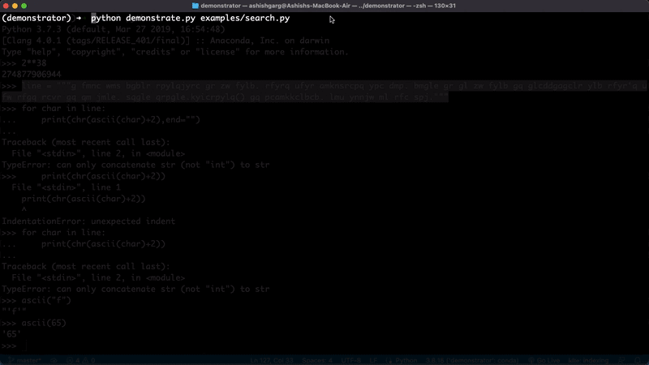
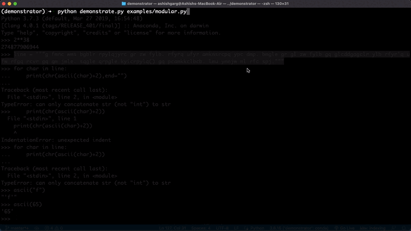

# Demonstrator - See how your code executes

A tool to show step by step real-time code execution over command-line interface and web.

## Demos

Code Execution with scope variables


Code Execution without scope variables



Code Execution of modular code



## How to use

Run the following command to check how your code executes

```bash
$ python demonstrate.py test.py
``` 